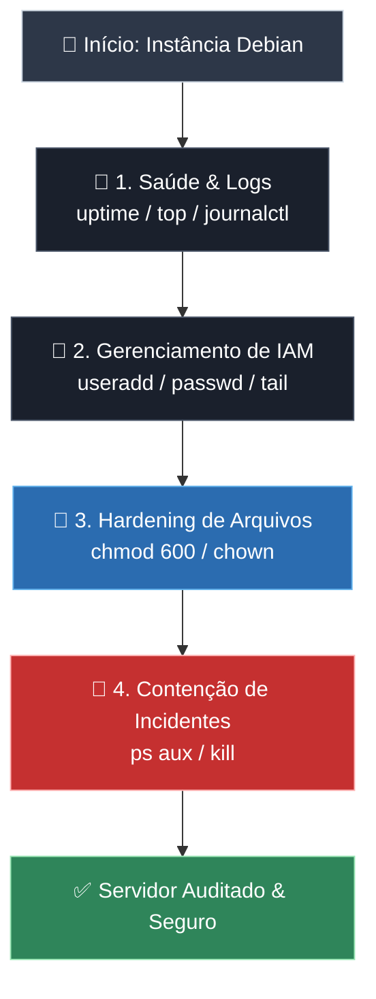

# 🛡️ Debian Security Benchmark: Auditoria e Hardening Baseados em Princípios CIS

Este projeto apresenta a execução de um processo completo de **auditoria de segurança, hardening (fortalecimento) e resposta a incidentes** em um servidor Linux Debian. O objetivo é demonstrar a aplicação prática do **Princípio do Menor Privilégio**, governança de identidades e proteção de arquivos sensíveis.

---

## 📌 1. Mapeamento da Infraestrutura e Saúde do Sistema

### **Objetivo:**

Registrar a estabilidade do servidor e verificar os logs do sistema antes de aplicar as mudanças de segurança.

### **Comandos Executados:**

```bash
# Verificar tempo de atividade e carga do servidor (Load Average)
uptime

# Monitorar em tempo real os processos e o consumo de CPU/RAM
top

# Listar os arquivos de log e suas permissões no diretório padrão
cd /var/log && ls -la

# Inspecionar as primeiras linhas do log principal do sistema
head -n 10 syslog
```


> **Justificativa de Segurança:**  
> Garante a visibilidade do ambiente, permitindo identificar se a instância já possui anomalias de desempenho ou picos de processamento antes de qualquer intervenção.

---

## 📌 2. Auditoria e Gestão de Identidades (IAM)

### **Objetivo:**

Inspecionar os usuários cadastrados e criar uma conta de administração exclusiva, eliminando a dependência do uso direto da conta root.

### **Comandos Executados:**

```bash
# Inspecionar as contas registradas no sistema
cat /etc/passwd

# Criar um novo usuário exclusivo para auditoria com pasta home e shell bash
sudo useradd -m -s /bin/bash analista_sec

# Definir uma senha forte para o novo usuário
sudo passwd analista_sec

# Validar a criação da nova conta no final do arquivo de usuários
tail -n 5 /etc/passwd
```


> **Justificativa de Segurança:**  
> Aplicação do princípio de não-repúdio. Cada ação no servidor deve ser atrelada a uma identidade nominal e rastreável, evitando o compartilhamento da conta root.

---

## 📌 3. Hardening e Proteção de Arquivos Sensíveis

### **Objetivo:**

Simular a criação de um arquivo contendo credenciais sigilosas e restringir seu acesso apenas ao seu proprietário legítimo.

### **Comandos Executados:**

```bash
# Criar diretório e arquivo simulando armazenamento de credenciais
mkdir /tmp/dados_sensiveis
touch /tmp/dados_sensiveis/chaves.txt

# Verificar as permissões padrão atribuídas pelo sistema
ls -la /tmp/dados_sensiveis

# Restringir permissões: leitura e escrita apenas para o dono (chmod 600)
chmod 600 /tmp/dados_sensiveis/chaves.txt

# Transferir a posse do arquivo e do grupo para o usuário analista_sec
sudo chown analista_sec:analista_sec /tmp/dados_sensiveis/chaves.txt

# Validar o novo estado de permissões do arquivo
ls -la /tmp/dados_sensiveis
```


> **Justificativa de Segurança:**  
> Evita movimentação lateral dentro do servidor. Se outro usuário não autorizado comprometer o sistema, ele não conseguirá ler arquivos de credenciais protegidos com permissão `600`.

---

## 📌 4. Resposta a Incidentes: Contenção de Processos

### **Objetivo:**

Simular a identificação e a interrupção imediata de um processo suspeito ou não autorizado em execução.

### **Comandos Executados:**

```bash
# Simular a execução de um processo suspeito em segundo plano
sleep 300 &

# Encerrar o processo suspeito enviando um sinal de encerramento pelo PID
kill <PID_DO_PROCESSO>
```


> **Justificativa de Segurança:**  
> Demonstra capacidade operacional para contenção de ameaças em tempo real, interrompendo scripts maliciosos ou processos que estejam consumindo recursos indevidamente.


