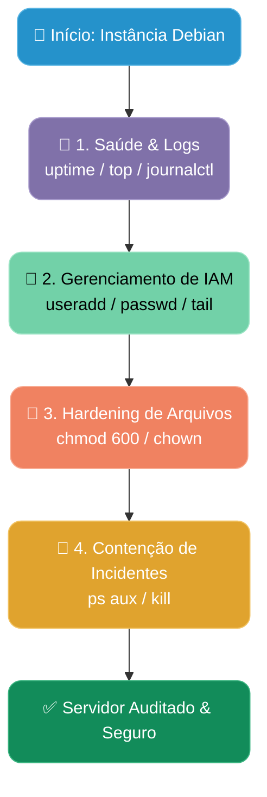

# 🛡️ Debian Security Benchmark: Auditoria e Hardening Baseados em Princípios CIS

Este projeto apresenta a execução de um processo completo de **auditoria de segurança, hardening (fortalecimento) e resposta a incidentes** em um servidor Linux Debian. O objetivo é demonstrar a aplicação prática do **Princípio do Menor Privilégio**, governança de identidades e proteção de arquivos sensíveis.

---

## 🛠️ Pré-requisitos e Ambiente de Testes

Para reproduzir este laboratório, você precisará de:

- **Sistema Operacional:** Debian 13 ou 13 (pode ser executado em VM VirtualBox ou Hyper-v).
- **Acesso:** Permissões de superusuário (`su -`).
- **Ferramentas:** Terminal Bash padrão.

---

### 📊 Fluxo Operacional do Processo de Hardening



---

## 📌 1. Mapeamento da Infraestrutura e Saúde do Sistema

### **Objetivo:**

Verificar a estabilidade do servidor e verificar os logs do sistema antes de aplicar as mudanças de segurança.

### **Comandos Executados:**

```bash
# Verificar tempo de atividade e carga do servidor (Load Average)
uptime

# Monitorar em tempo real os processos e o consumo de CPU/RAM
top

# Listar os arquivos de log e suas permissões no diretório padrão
cd /var/log && ls -la

# Inspecionar as primeiras linhas do log principal do sistema
head -n 10 syslog
```


> **Justificativa de Segurança:**  
> Garante a visibilidade do ambiente, permitindo identificar se a instância já possui anomalias de desempenho ou picos de processamento antes de qualquer intervenção.

---

## 📌 2. Auditoria e Gestão de Identidades (IAM)

### **Objetivo:**

Inspecionar os usuários cadastrados e criar uma conta de administração exclusiva, eliminando a dependência do uso direto da conta root.

### **Comandos Executados:**

```bash
# Inspecionar as contas registradas no sistema
cat /etc/passwd

# Criar um novo usuário exclusivo para auditoria com pasta home e shell bash
sudo useradd -m -s /bin/bash analista_sec

# Definir uma senha forte para o novo usuário
sudo passwd analista_sec

# Validar a criação da nova conta no final do arquivo de usuários
tail -n 5 /etc/passwd
```


> **Justificativa de Segurança:**  
> Aplicação do princípio de não-repúdio. Cada ação no servidor deve ser atrelada a uma identidade nominal e rastreável, evitando o compartilhamento da conta root.

---

## 📌 3. Hardening e Proteção de Arquivos Sensíveis

### **Objetivo:**

Ajustar a pasta para um diretório de produção mais realista (fora do /tmp), criar o arquivo e aplicar o Princípio do Menor Privilégio..

### **Comandos Executados:**

```bash
# Criar diretório seguro no /var

sudo mkdir -p /var/app/secrets

# Criar o arquivo de credenciais

sudo touch /var/app/secrets/chaves.txt

# Trocar o dono do arquivo para o usuário analista_sec

sudo chown analista_sec:analista_sec /var/app/secrets/chaves.txt

# Restringir leitura e escrita apenas para o dono (chmod 600)

sudo chmod 600 /var/app/secrets/chaves.txt

# Validar o novo estado de permissões

ls -la /var/app/secrets/chaves.txt
```


> **Justificativa de Segurança:**
> Evita movimentação lateral dentro do servidor. Se outro usuário não autorizado comprometer o sistema, ele não conseguirá ler arquivos de credenciais protegidos com permissão `600`.

---

## 📌 4. Resposta a Incidentes: Contenção de Processos

### **Objetivo:**

Simular o processo suspeito em segundo plano, identificá-lo com ps aux e encerrá-lo.

### **Comandos Executados:**

```bash
# Iniciar o processo em segundo plano (o '&' envia para o background)

sleep 300 &

# Localizar o PID do processo 'sleep'

ps aux | grep sleep

# Encerrar o processo (Substitua PID_DO_PROCESSO pelo número capturado no passo acima)

kill <PID_DO_PROCESSO>

# Confirmar que o processo foi encerrado

ps aux | grep sleep
```


> **Justificativa de Segurança:**
> Capacidade operacional para contenção de ameaças em tempo real, interrompendo scripts maliciosos ou processos que estejam consumindo recursos indevidamente.

---

## 🚀 Próximos Passos (Roadmap de Evolução)

Seguindo a trilha do projeto de estudo de segurança em nuvem, as próximas etapas priorizadas são:

- **3. [Redes] Protocolos, Portas e Modelo TCP/IP, Servidores Web (Apache/Nginx) e Hardening**
  - Mapeamento e liberação de portas estratégicas (firewall `ufw`/`iptables`).
  - Implantação de servidores web e aplicação de hardening em configurações de Apache/Nginx.
- **4. [DB] Bancos de Dados Relacionais e Práticas de Segurança SQL**
  - Instalação e configuração segura de bancos de dados relacionais.
  - Aplicação de boas práticas de controle de acesso e auditoria em SQL.
- **5. [Scripting] Automação com Shell Script e PowerShell**
  - Criação de scripts em Shell para automação de rotinas de auditoria em ambiente Linux.
  - Automação de tarefas administrativas cross-platform usando PowerShell.
- **6. [Scripting] Python para Cloud & Automação com Boto3**
  - Desenvolvimento de rotinas em Python para gerenciamento e auditoria de segurança.
  - Automação de recursos de infraestrutura em nuvem (AWS) com a biblioteca `boto3`.

---

## 🤝 Agradecimentos

Agradecimento especial ao **Edson Bezerra** (_Manager, LATAM Cyber Security Infrastructure Services - DXC Technology_) pela mentoria, orientações estratégicas e incentivo na estruturação deste plano de estudos.

```

```
